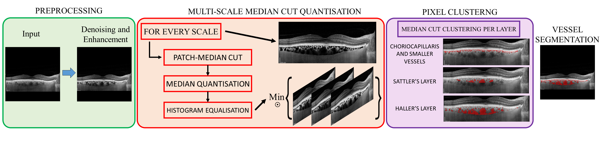
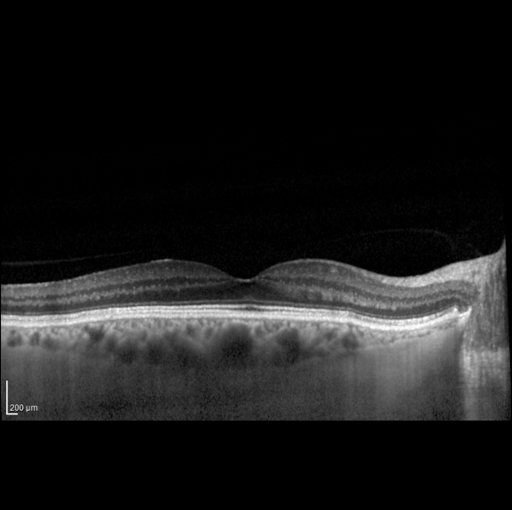

# MMCQ: Semi-automatic choroid vessel segmentation in OCT

This repository stores the code for vessel segmentation of the choroidal vasculature as seen in enhanced depth imaging optical coherence tomogephy (EDI-OCT) images.

A brief description of the methodology can be found [here](https://tvst.arvojournals.org/article.aspx?articleid=2793042), of which MMCQ was used to construct vessel segmentation labels for training [Choroidalyzer](https://github.com/justinengelmann/Choroidalyzer), an open source, end-to-end deep learning for analysing the choroid.

---

### MMCQ: Multi-scale median cut quantisation



This algorithm first enhances the choroidal region and, in particular, choroidal vessel walls which are typically ambiguously defined with low contrast. This enhancement utilises a combination of quantisation and histogram equalisation, and is done at multiple scales based on the size of the choroid for improving vessel wall definition for vessels of different size. After enhancement from quantisation and histogram equalisation, choroid pixels are then segmented using median cut pixel clustering, which is done at different layers of the choroid, i.e. to cluster pixels at different scales. See the GIF below for a visual demonstration of the technique.

<p align="center">
  
</p>

MMCQ can be used to segment the choroidal vessels in OCT B-scans, which can then subsequently be used to measure vessel-based metrics, such as choroid vascular index or choroid vessel area. If you wish to use this methodology to measure choroid vessel parameters such as Choroid Vascular Index (CVI), we strongly encourage you to consider using [DeepGPET](https://github.com/jaburke166/deepgpet), which is freely available to download. This is in order to obtain region segmentations of the choroidal space which is required to measure CVI. 

---

## Project Stucture

```
.
├── choves/		# Core module for carrying out choroid region segmentation and derived regional measurements
├── example_data/	# Example OCT B-scans to demonstrate usage
├── install/		# Files for setting up codebase
├── .gitignore
├── README.md
└── install.txt		# Anaconda prompt commands for building conda environment with core packages
```

- The code found in `choves`
```
.
├── choves/
├───── enhance/		# Code for choroid enhancement using quantisation and histogram equalisation at multiple scales          
├───── metrics/		# Code to calculate downstream metrics
├───── __init__.py
├───── segment.py	# Code to perform vessel segmentation
└───── utils.py		# Helper functions for preprocessing, plotting and postprocessing segmentations
```

- The code found in `choves/metrics`
```
.
├── metrics/
├───── __init__.py                          
├───── choroid_metrics.py   # Code to calculate choroid measurements
├───── choroid_utils.py     # Utility functions for measuring the choroid
└───── pixel_gui.py         # OpenCV-based implementation of a simple GUI to select pixels manually
```

- The files found in `install`
```
.
├── install/                             
├───── figures/             # Folder of images for README file
├───── conda.pth            # File to link MMCQ's (and DeepGPET's) local repository folder to the conda environment
└───── install.txt          # Anaconda Prompt commands to built conda environment and packages
```


## Getting Started

To get a local copy up and running follow these steps.

1. Clone the repo via `git clone https://github.com/jaburke166/mmcq.git`.

2. For obtaining choroid region segmentations, clone the [DeepGPET](https://tvst.arvojournals.org/article.aspx?articleid=2793042) repository. Instructions for setting this up are identical and are found on the corresponding README.

3. You will need a local installation of python to run MMCQ (and DeepGPET). We recommend a lightweight package management system such as Miniconda. Follow the instructions [here](https://docs.anaconda.com/free/miniconda/miniconda-install/) to download Miniconda for your desired operating system.

4. After downloading, navigate and open the Anaconda Prompt, and individually copy and run each line found in `install/install.txt` to create your own environment in Miniconda and download the necessary packages.
    - Note if you have a GPU running locally to use DeepGPET, line 2 in `install/install.txt` should be `pip3 install torch torchvision --index-url https://download.pytorch.org/whl/cu121`
  
5. Copy the file `conda.pth` in `install/` file into your python environments `site-packages` directory, commonly found at `path\to\miniconda3\envs\choroid-analysis\Lib\site-packages`
    - Change the file paths in `conda.pth` the absolute file paths that link to the MMCQ (and DeepGPET) Github repositories.
    - This means your conda environment `choroid-analysis` now has access to the files in your loca copy of MMCQ (and DeepGPET).
    - Importantly, you can now use `import choves, choseg` in any notebook or python script which uses this conda environment.
  
6. Activate your new environment using `conda activate choroid-analysis` on an Anaconda Prompt terminal.

7. Launch notebooks using `jupyter notebook` or jupyter labs using `jupyter lab` and see the minimal example below so that you can analyse your own choroids!

Done! You have successfully set up the software to analyse the choroid in OCT B-scans!

If you have any problems using this method, please do not hesitate to contact us!

### Minimal example

See the minimal example in the notebook `usage.ipynb`. Below is a small code snippet to quickly run DeepGPET and MMCQ on an OCT B-scan, and measure the choroid.

```
# Load choroid region and vessel segmentation libraries
from pathlib import Path
from choves import segment, utils
from choves.metrics import choroid_metrics, choroid_utils
from choseg import inference

# Load image
example_path = Path("example_data")
img_path = example_path / "image1.png" #"path\to\img"
img = utils.load_img(img_path)

# Instantiate inference class for DeepGPET
deepgpet = inference.DeepGPET()

# Segment region with DeepGPET
img_regseg = deepgpet(img)
img_bounds = utils.get_trace(img_regseg) # Detects the upper and lower choroid boundaries based on the mask

# Plot region segmentation superimposed onto image
utils.plot_img(img, traces=img_bounds, cmap=utils.generate_imgmask(img_regseg), sidebyside=True) # Plots the image, trace and segmentation colour map

# Segment vessels with MMCQ
img_vesseg = segment.segment_vessels(img, img_bounds)

# Plot vessel segmentation superimposed onto image
utils.plot_img(img, traces=img_bounds, cmap=utils.generate_imgmask(img_vesseg), sidebyside=True) # Plots the image, trace and segmentation colour map

# Measure the choroid
choroid_metrics.compute_choroid_measurement(img_regseg, img_vesseg)
# thickness (microns) temporal, subfoveal and nasal (190, 290, 130), area 1.374898mm2, vascular index 0.62044, vessel area 0.853041mm2
```

Please refer to `usage.ipynb` for a more in depth description of segmenting the choroid using DeepGPET, MMCQ, and measuring choroid thickness, area, vascular index and vessel area.

---

### Related repositories

If you are interested in choroid analysis in OCT images, check these repositories out:

* [DeepGPET](https://github.com/jaburke166/deepgpet): A fully-automatic, deep learning-based method for choroid region segmentation in OCT B-scans.
* [Choroidalyzer](https://github.com/justinengelmann/Choroidalyzer): A fully automatic, deep learning-based tool for choroid region and vessel segmentation, and fovea detection in OCT B-scans.
* [EyePy](https://github.com/MedVisBonn/eyepy): A selection of python-based readers of various file formats of OCT B-scans, including `.vol` and `.e2e` format from Heidelberg.

---
## Contact, Contributors and Citing

The contributors to this codebase are:

* Jamie Burke (Jamie.Burke@ed.ac.uk)
